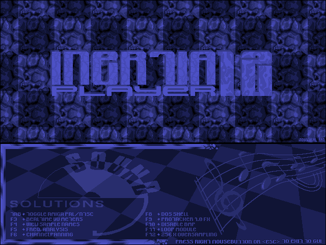

# Inertia Player

A clean-room modernization of Inertia Player V1.22, preserving the original DOS program and reverse-engineering references alongside the modern SDL2/notcurses/libmikmod player and behavioral tests.



## Layout

- `original/`: original executable, disassembly, listing, and translated reference output.
- `rewrite/`: DOS-compatible rewrite, modern host player, SDL/notcurses presentation, SB16-compatible audio seam, and build scripts.
- `tests/`: behavioral, ABI, rendering, audio, and original-vs-rewrite regression tests.
- `samples/`: tracker modules used by integration tests and manual playback.

## Host player

Dependencies: C/C++17 compiler, SDL2, SDL2_image, notcurses, libmikmod, libmodplug, libpng, Python 3, and pytest.

### Ubuntu

```bash
sudo apt update
sudo apt install build-essential pkg-config libsdl2-dev libsdl2-image-dev libnotcurses-dev libmodplug-dev
./rewrite/build_native_player.sh
./iplay.sh samples/aryx.s3m
./iplay.sh
```

Running without a module opens the interactive file selector.

### Windows

Prebuilt, self-contained Windows and Ubuntu archives are available from GitHub
Releases. The Windows archive includes the required UCRT64 DLLs. Run:

```text
iplay.exe HACKER4.S3M
```

To build on Windows, install MSYS2, open an **MSYS2 UCRT64** shell, and run:

```bash
pacman -S --needed git make mingw-w64-ucrt-x86_64-toolchain \
  mingw-w64-ucrt-x86_64-pkgconf mingw-w64-ucrt-x86_64-SDL2 \
  mingw-w64-ucrt-x86_64-SDL2_image mingw-w64-ucrt-x86_64-libmodplug \
  mingw-w64-ucrt-x86_64-notcurses
./rewrite/build_native_player.sh
```

Release archives are produced automatically by
`.github/workflows/release.yml` when a `v*` tag is pushed. The workflow can
also be run manually and given a release tag.

### Android

The Android frontend uses SDL2 and libxmp-lite. It opens the bundled
`HACKER4.S3M` module and provides a system file picker plus large touch
controls for seek backward, pause/resume, seek forward, visualization mode,
volume down/up, and exit. The picker uses Android's Storage Access Framework,
so it does not require broad storage permission. The default visualization is
an F2-style ten-scope waveform view; the visualization button switches to a
spectrum view and back. The F2 view uses the packaged high-resolution
`iplay.png` as an aspect-fitted background.

```bash
cd android
./prepare.sh
gradle :app:assembleDebug
```

The build requires Android SDK 35, NDK `27.2.12479018`, CMake 3.22.1, JDK 17,
and Gradle 8.10.2. GitHub Actions builds and verifies the APK automatically;
local Android SDK installation is optional.

## Tests

```bash
pytest -q
```

Some DOS/original-binary tests additionally require OpenWatcom, kvikdos, and mzretools. Paths can be configured in the existing test/build environment variables documented by the scripts.
